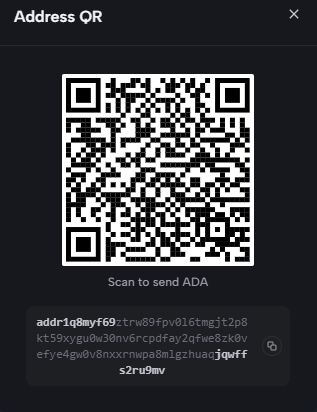

🏗️ Nguyên lý hoạt động
Công cụ này đóng vai trò là một "Trợ lý soạn thảo lệnh CLI". Thay vì phải tự tính toán UTXO, phí giao dịch (Fee) và tiền thừa (Change), công cụ này sẽ tự động soạn thảo đoạn mã cardano-cli hoàn chỉnh cho bạn.

Tại Web (Online/Local): Bạn nhập các thông số, công cụ tạo ra câu lệnh cardano-cli build-raw tương ứng.

Tại máy Offline (CLI): Bạn copy câu lệnh đó, dán vào Terminal trên máy tính đã cài cardano-cli và chứa khóa bí mật để thực thi.

📋 Hướng dẫn thực thi
Bước 1: Soạn lệnh trên Web Tool
Truy cập [Link Online] hoặc mở Tool-Cardano.html.

Nhập các thông tin: UTXO nguồn, địa chỉ ví nhận, số tiền.

Nhấn "Generate CLI Command". Một đoạn code CLI sẽ xuất hiện.

Copy đoạn code đó.

Bước 2: Chạy lệnh trên máy tính Offline
Tại máy tính đã cài đặt cardano-cli và chứa file payment.skey:

1. Mở Terminal và dán đoạn code vừa copy vào, sau đó nhấn Enter.
Ví dụ đoạn lệnh bạn sẽ nhận được:

cardano-cli transaction build-raw \
    --tx-in [TX_ID_1] \
    --tx-in [TX_ID_2] \
    --tx-out [ADDR]+[AMOUNT] \
    --fee [FEE] \
    --out-file tx.raw

2. Sau khi chạy xong, file tx.raw sẽ được tạo ra trong thư mục của bạn.

Bước 3: Ký và Gửi giao dịch
Sau khi đã có file tx.raw, bạn thực hiện tiếp 2 bước ký và gửi:

Ký giao dịch:
cardano-cli transaction sign --tx-body-file tx.raw --signing-key-file payment.skey --mainnet --out-file tx.signed

Bước 4: sau khi có file chữ ký ở máy off Đẩy giao dịch lên Blockchain (Web Tool)
Quay trở lại Web Tool:

Chọn tính năng "Submit Transaction" (hoặc mục Upload file chữ ký).

Tải file tx.signed (file chứa chữ ký bạn vừa tạo ở Bước 2) lên công cụ.

Nhấn "Submit/Broadcast Transaction". Công cụ sẽ sử dụng Blockfrost API để đẩy giao dịch đã ký của bạn trực tiếp lên mạng lưới Cardano.

If you find this tool helpful for securing your Cardano assets, consider supporting the development:

Cardano (ADA): addr1q8myf69ztrw89fpv0l6tmgjt2p8kt59xygu0w30nv6rcpdfay2qfwe8zk0vefye4gw0v8nxxrnwpa8mlgzhuaqjqwffs2ru9mv

Every contribution helps keep this project updated, secure, and free for everyone.

[Tải xuống file tại đây](Tool-Cardano.html)
